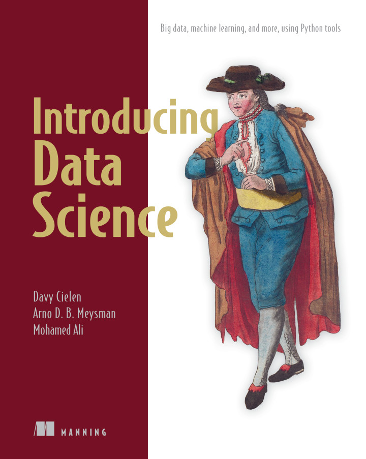
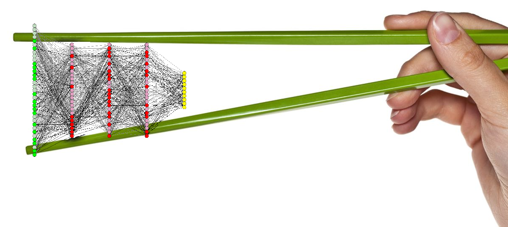
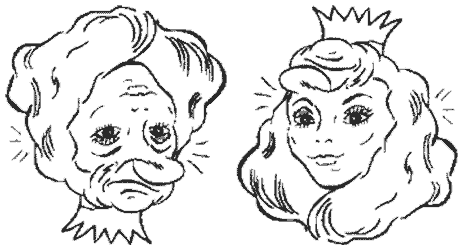
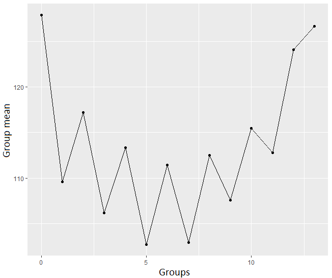
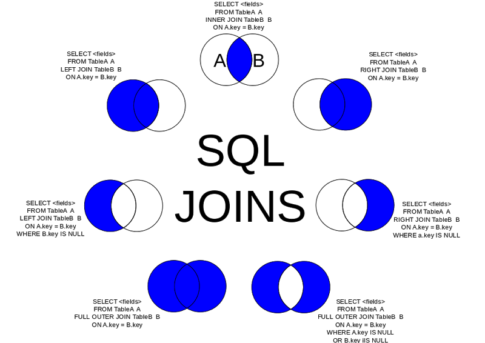

```{r setupand package loading, include=FALSE}
library(xtable)
library(data.table)
library(DT)
library(zoo)
library(dplyr)

knitr::opts_chunk$set(echo = FALSE)
```

## Inspiration: garbage in - garbage out: nothing is more true!

<center><a href="http://blog.appliedinformaticsinc.com/data-mining-challenges-in-data-cleaning/"></a></center>

## "Sponsors" of today's theme

- [Davy Cielen, Arno D.B. Meysman, Mohamed Ali "Introducing Data Science: Big Data, Machine Learning, and more using Python tools"](https://www.manning.com/books/introducing-data-science)
- my colleagues Anton and two Kates and the tasks we solve daily
- Kaggle as antipode

<div>
<center>
  
 
 
 </center>
</div>

## Practice follows: example datasets

```{r, echo = FALSE}
test_results_64_process <- read.csv2(file = "data/test_results_set_Feb_to_Apr.csv", stringsAsFactors = FALSE)

test_results_64_process$header_col_3 <- as.POSIXct(as.character(test_results_64_process$header_col_3), format = "%Y-%m-%d %H:%M:%S", tz = "")
```

1. Dataset with "some" test results: contains `r nrow(test_results_64_process)` rows and `r ncol(test_results_64_process)` columns.

2. Datasets with test times for these test results:

```{r, echo = FALSE}
testtime_64_process <- read.csv2(file = "data/test_time_set_Feb_to_Apr_64_process.csv", stringsAsFactors = FALSE)
testtime_66_process <- read.csv2(file = "data/test_time_set_Feb_to_Apr_66_process.csv", stringsAsFactors = FALSE)

testtime_64_process$header2_col_3 <- as.POSIXct(as.character(testtime_64_process$header2_col_3), format = "%Y-%m-%d %H:%M:%S", tz = "")
testtime_66_process$header3_col_3 <- as.POSIXct(as.character(testtime_66_process$header3_col_3), format = "%Y-%m-%d %H:%M:%S", tz = "")
```

  + first process: contains `r nrow(testtime_64_process)` rows and `r ncol(testtime_64_process)` columns;
  + second process: contains `r nrow(testtime_66_process)` rows and `r ncol(testtime_66_process)` columns.

Quick summary on the data:

<center></center>

# Must-do | obligatory "sanity checks" when starting DA process

## Data Types

Always check data types before starting anything else. Most common points:

1. does string variable really mean string? Or factor?
2. are all the numerical data columns factors?
3. are all factors just factors or some of them are ranked?

<center><a href="http://www.postgresqltutorial.com/wp-content/uploads/2013/05/PostgreSQL-Data-Types-300x254.png"></a></center>

---

> **Unofficial rule**: if unique values are 3% or less of all the data length - that might be a factor

Both Python, R (and Excel :0 ) are trying to guess the column types - don't forget to cross-check it! Sometimes reading-all-in as characters and transforming onto numeric is better.

<center></center>

> **Certain methods "eat" certain types and you'd better not to cheat on it!**

## Data types example:

```{r data types, echo = FALSE, results='asis'}
exploratory_info_before <- data.frame(colname = names(test_results_64_process))
exploratory_info_before$type <- sapply(test_results_64_process, typeof)
exploratory_info_before$num_of_unique_values <- apply(test_results_64_process, 2, function(x){length(unique(x))})
exploratory_info_before$num_of_unique_values_no_na <- apply(test_results_64_process, 2, function(x){ifelse(sum(is.na(x)) > 0, as.integer(length(unique(x)) -1), length(unique(x)))})
exploratory_info_before$NAs_percentage <- apply(test_results_64_process, 2, function(x){sum(is.na(x))/length(x)*100})

# print.xtable(xtable(table(exploratory_info_before$type)), type = "html", include.rownames = TRUE)
options(DT.options = list(pageLength = 4, autoWidth = TRUE, paging = FALSE, searching = FALSE, info = FALSE))
datatable(as.data.frame(table(exploratory_info_before$type)))
```

---

DEMO:

`header_col_3` (POSIX to integer)  | `test_result_col_1700` (factor to integer) | `test_result_col_1282` (double as-is)
-----------------------------------|----------------------------------|--------------------------------
Min.: "2017-02-01 20:09:12"        | -35: 3400                        |Min.: 0.0000
1st Qu.: "2017-02-07 01:35:31"     | -17: 10156                       |1st Qu.: 0.7165
Median: "2017-02-09 14:31:11"      |                                  |Median: 1.1360
Mean: "2017-02-13 10:07:59"        |                                  |Mean: 1.2220
3rd Qu.: "2017-02-13 03:57:39"     |                                  |3rd Qu.: 1.4560
Max.: "2017-04-13 09:29:43"        |                                  |Max.: 57.2200
NA's: 0                            |                                  |NA's: 530 


## Data distributions

* features distributions expected to be fixed;
* check it when you receive new data to apply your pre-built model:

<div>
  
 
</div>

## NA values

- Is it a good idea to omit NAs?

*see what will happen if we'll omit NAs from our data sets directly*: rows in data with NA omit directly is **`r sum(complete.cases(test_results_64_process))`**!

### So we'd better deal with NA more intelligently ;)

*Hint*: if there are lots of NAs in dataset, make a separate variable as NA percentage counter for every row - this may help later.

```{r, echo=FALSE, eval=FALSE}
test_results_64_process$na_percentage <- rowMeans(is.na(test_results_64_process))
```

*Hint 2*: note that header rows rarely have NAs inside them.

***

Step-by-step NAs omitting:

* remove columns with high percentage of NAs (say, more than 95% of column are NAs);
* remove **rows** with high percentage of NAs (say, more than 90% of row are NAs);
* finally (though you can continue as long as needed!) filter out more columns (say, which have more than 75% of NAs).

```{r omit NA columns}
# Function to skip columns with high number of NAs, perc_in is a parameter, columns that have more than perc_in portion of NAs are excluded
filter_na_columns <-function(data_table_in, perc_in = 0.95){
  return(data_table_in[ , colMeans(is.na(data_table_in)) < perc_in])
}

test_results_64_process <- filter_na_columns(test_results_64_process, 0.95)
```

```{r omit NA rows}
# Function to skip rows with high number of NAs, perc_in is a parameter, rows that have more than perc_in portion of NAs are excluded
filter_na_rows <-function(data_table_in, perc_in = 0.7){
  return(data_table_in[rowMeans(is.na(data_table_in)) < perc_in, ])
}

test_results_64_process <- filter_na_rows(test_results_64_process, 0.9)
```

```{r omit NA columns 2}
# Filtering out more columns - which have more than 75 percent of missing values
test_results_64_process <- filter_na_columns(test_results_64_process, 0.75)
```

What we have how? **`r sum(complete.cases(test_results_64_process))`** rows that are complete! We can omit non-complete rows now.

```{r omit NA}
test_results_64_process <- na.omit(test_results_64_process)
```

**Hint**: block NA test.

## Multicollinearity

Inspiration: [Mercedes EDA & XGBoost Starter (~0.55) by anokas](https://www.kaggle.com/anokas/mercedes-eda-xgboost-starter-0-55)

* **Constant features**: "Interestingly, we have ... features which only have a single value in them - these are pretty useless for supervised algorithms, and should probably be dropped (unless you want to use them for anomaly detection in case a different value appears in the test set)" => filtering out factors with 1 level only

```{r}
# Now filter out factors with 1 level only
test_results_64_process <- test_results_64_process[, apply(test_results_64_process, 2, function(x){ifelse(length(unique(x)) > 1, TRUE, FALSE)})]
```

**NOTE:** some of the header rows have been filtered out as well.

* "Near zero variance": a feature has near zero variance ifit has very few unique values relative to the number of samples and the ratio of the frequency of the most common value to the frequency of the second most common value is large.

```{r, warning = FALSE}
# Filter columns with near zero variance
exclude_near_zero_variance <- function(data_table_in, freqCut_in = 95/5, uniqueCut_in = 10){
  require('caret', quietly = TRUE, warn.conflicts = FALSE)
  nzvar<-nearZeroVar(data_table_in, freqCut = freqCut_in, uniqueCut = uniqueCut_in, names = TRUE, saveMetrics = FALSE)
  for(cols in nzvar)
    data_table_in[[cols]] <- NULL
  return (data_table_in[])
}

test_results_64_process <- exclude_near_zero_variance(test_results_64_process)
```

***

* **Multicollinearity** by itself

```{r exclude multicollinear, eval=FALSE}
# Exclude completely collinear variables (corr > 0.99 between every two and > 0.96 among others) - dont' forger to save the header for later!
library(caret)

test_results_64_process_for_cor <- select(test_results_64_process, - matches("header"))
correlationMatrix <- cor(test_results_64_process_for_cor)
highlyCorrelated <- findCorrelation(correlationMatrix, cutoff=0.99, names = TRUE, exact = TRUE)

test_results_64_process <- test_results_64_process[, !(names(test_results_64_process) %in% highlyCorrelated)]

# rm(test_results_64_process_for_cor, correlationMatrix, highlyCorrelated)
```

**NOTE**: when removing one of the collinear variables one should always remember that 99% becomes 96% when going through the columns etc.

* **Non-multicollinearity** at first sight: correlation is 0.6

<center></center>

## Outliers

Example rules:

* **mean $\pm$ 3 sigma** --- 99.7% of the population is contained within 3 standard deviations from the mean (in case of normal distribution);
* **1Q - 1.5 IQR to 3Q + 1.5 IQR** --- [Motivation to use this criterion by Rob J. Hyndman](https://stats.stackexchange.com/a/1153/74599);
* **0.01 quantile - 1.5 IQR to 0.99 quantile + 1.5 IQR** --- In case we want to remove completely outstanding observations.

## Other ideas for preliminary check

* misspellings;
* extra whitespaces;
* whitespace and tab problem;
* lowercase / uppercase.

**RegExp**s are the Dirty Data's worst enemies and Tidy Data's best friends!

<center></center>

# Tidying data

## Tidy data definition for today

As you probably've heard, according to [Hadley Wickham's article "Tidy Data"](http://vita.had.co.nz/papers/tidy-data.html),

"In tidy data:

1. Each variable forms a column.
2. Each observation forms a row.
3. Each type of observational unit forms a table."

In practice, I'd recommend you to use header analysis beforehand.

## Headers and their analysis

First of all, get "table" of header rows meanings:

```{r, results='asis'}
test_results_64_process_header <- select(test_results_64_process, matches("header"))

header_info <- data.frame(colname = names(test_results_64_process_header))
header_info$type <- sapply(test_results_64_process_header, typeof)
header_info$num_of_unique_values <- apply(test_results_64_process_header, 2, function(x){length(unique(x))})

# print.xtable(xtable(header_info), type = "html", include.rownames = TRUE)
options(DT.options = list(pageLength = 5, autoWidth = TRUE, paging = FALSE, searching = FALSE, info = FALSE))
datatable(header_info)
```

---

Some of the header rows are likely to be factors, look at them carefully (`header_col_7` vs. `header_col_10`):

```{r, results='asis'}
options(DT.options = list(pageLength = 10, autoWidth = TRUE, paging = FALSE, searching = FALSE, info = FALSE))
datatable(as.data.frame.matrix(table(test_results_64_process_header$header_col_7, test_results_64_process_header$header_col_10)))
```

Evident grouping!

## Data groups

As we've seen, data header contains several groups. We have 2 options:

* add these groups as factors, or
* separate the whole data set into groups and perform separate analysis for every group.

Which option to choose?

1. If you plan to perform classification -- option 1;
2. If you plan to perform regression -- option 2.

---

Do I have to have groups at all?

Check:

1. F Test to Compare Variances between groups;
2. Student's t-Test to check significant difference in mean values between the groups.

<center></center>

## Data joining

Double-**triple**-**QUADRUPLE** check what you're doing here!!!

<center><a href="http://bailiwick.io/content/images/2015/07/SQL_Join_Types-1.png"></a></center>

## Code book and column specifications

Big Data is usually that big you'll not be ablt to have any code book -- just relax and enjoy your non-acquaintance ;)

But! If you're lucky enough to get it - don't waste it!

<center><a href="https://static.probusiness.by/n/02/5/stopka_dokumentov.png"></a></center>

## "Dealing with data" pipeline

Second most important thing in data cleaning.

Don't get lazy - build it!

Solved inside pipeline:

1. Data obtaining (+ updating if necessary);
2. All the data cleaning steps;
3. All the post-cleaning checks (distributions, means, variances etc.).

Pipeline must be fixed!

## Insight first - analysis later

**THE MOST** important thing.

* if there's a problem statement - ask for an example;
* if there's no example -- feel free to choose any method and play with data in your favourite way! Yummy!
* one dataset may suite one goal and not suite another at all. The goal of analysis must be specific enough so that you can detect this in case.

## Enjoy your data!

<center></center>

<center>Hanna Rudakouskaya</center>
<center>Data Analyst, Teqniksoft</center>
<center>http://hannarud.github.io/</center>

## Links - FYU

* [Davy Cielen, Arno D.B. Meysman, Mohamed Ali "Introducing Data Science: Big Data, Machine Learning, and more using Python tools"](https://www.manning.com/books/introducing-data-science);
* [Teqniksoft Homepage](https://teqniksoft.com/);
* [Kaggle: Your Home for Data Science](https://www.kaggle.com/);
* [Mercedes EDA & XGBoost Starter (~0.55) by anokas](https://www.kaggle.com/anokas/mercedes-eda-xgboost-starter-0-55);
* [Simple algorithm for online outlier detection of a generic time series](https://stats.stackexchange.com/questions/1142/simple-algorithm-for-online-outlier-detection-of-a-generic-time-series);
* ["Tidy Data" by Hadley Wickham](http://vita.had.co.nz/papers/tidy-data.html).