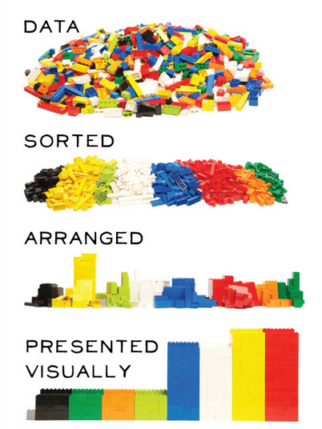

```{r setup, include=FALSE}
knitr::opts_chunk$set(echo = FALSE)
```

## Inspiration: garbage in - garbage out: nothing is more true!

<center></center>

Picture from Applied Informatics (<http://blog.appliedinformaticsinc.com/data-mining-challenges-in-data-cleaning/>).

