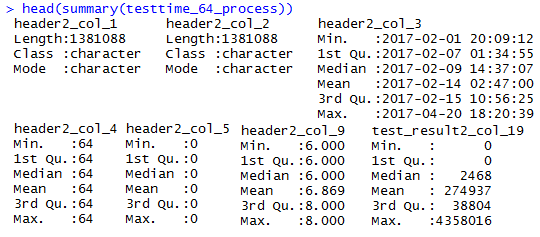
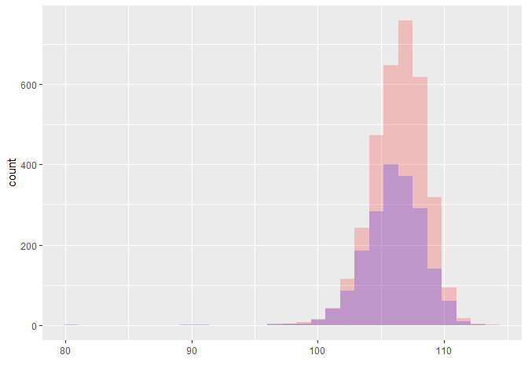

```{r setupand package loading, include=FALSE}
library(xtable)
library(data.table)
library(DT)
library(zoo)
library(dplyr)

knitr::opts_chunk$set(echo = FALSE)
```

## Inspiration: garbage in - garbage out: nothing is more true!

<center></center>

Picture from Applied Informatics (<http://blog.appliedinformaticsinc.com/data-mining-challenges-in-data-cleaning/>).

## "Sponsors" of today's theme

- [Davy Cielen, Arno D.B. Meysman, Mohamed Ali "Introducing Data Science: Big Data, Machine Learning, and more using Python tools"](https://www.manning.com/books/introducing-data-science)
- my colleagues Anton and two Kates and the tasks we solve daily
- Kaggle as antipode

## Practice follows: example datasets

```{r, echo = FALSE}
test_results_64_process <- read.csv2(file = "data/test_results_set_Feb_to_Apr.csv", stringsAsFactors = FALSE, nrows = 100)

test_results_64_process$header_col_3 <- as.POSIXct(as.character(test_results_64_process$header_col_3), format = "%Y-%m-%d %H:%M:%S", tz = "")
```

1. Dataset with "some" test results: contains `r nrow(test_results_64_process)` rows and `r ncol(test_results_64_process)` columns.

2. Datasets with test times for these test results:

```{r, echo = FALSE}
testtime_64_process <- read.csv2(file = "data/test_time_set_Feb_to_Apr_64_process.csv", stringsAsFactors = FALSE, nrows = 100)
testtime_66_process <- read.csv2(file = "data/test_time_set_Feb_to_Apr_66_process.csv", stringsAsFactors = FALSE, nrows = 100)

testtime_64_process$header2_col_3 <- as.POSIXct(as.character(testtime_64_process$header2_col_3), format = "%Y-%m-%d %H:%M:%S", tz = "")
testtime_66_process$header3_col_3 <- as.POSIXct(as.character(testtime_66_process$header3_col_3), format = "%Y-%m-%d %H:%M:%S", tz = "")
```

  + first process: contains `r nrow(testtime_64_process)` rows and `r ncol(testtime_64_process)` columns;
  + second process: contains `r nrow(testtime_66_process)` rows and `r ncol(testtime_66_process)` columns.

Quick summary on the data:

<center></center>

# Must-do | obligatory "sanity checks" when starting DA process

## Data Types

Always check data types before starting anything else. Most common points:

1. does string variable really mean string? Or factor?
2. are all the numerical data columns factors?
3. are all factors just factors or some of them are ranked?

> **Unofficial rule**: if unique values are 3% or less of all the data length - that might be a factor

Both Python, R (and Excel <i class="fa fa-frown-o"></i>) are trying to guess the column types - don't forget to cross-check it! Sometimes reading-all-in as characters and transforming onto numeric is better.

> **Certain methods "eat" certain types and it's better not to cheat on it!**

## Data types example:

```{r data types, echo = FALSE, results='asis'}
exploratory_info <- data.frame(colname = names(test_results_64_process))
exploratory_info$type <- sapply(test_results_64_process, typeof)

print.xtable(xtable(table(exploratory_info$type)), type = "html", include.rownames = TRUE)
```

LIVE DEMO: `header_col_3` (POSIX to integer), `test_result_col_1700` (integer), `test_result_col_282` (integer).

## Data distributions

Second-time view task mostly.

<div>
  
 
</div>

## Multicollinearity

Удаление попарных корреляций из данных и к чему это может привести

## Outliers

## NA values

- Is it a good idea to omit NAs?

Поступенчатое избавление от НА

## Other ideas for preliminary check

* misspellings;
* extra whitespaces;
* whitespace and tab problem;
* lowercase / uppercase.

## Headers and their analysis

Разработка метрики для kNN в случае ранжированных переменных и подобное

взять количество unique (ну и вообще, повторить табличку exploratory info)

взять table - для определения а) частот значений б) непересекающегося подмножества значений

## Data groups

- нужно ли делать данные на группы?
- если да, то по какой причине?
- в чем заключается различие между группами с точки зрения результатов именно этой задачи?- тесты на различие групповых средних и групповых дисперсий - лучший пример

## Data joining

Потом- - объединение данных друг с другом для решения конкретной задачи

## Insight first - analysis later

- если есть проблема - дожен быть пример проблемы с ожидаемым решением
- если нет примера - руки развязаны применять любые методы и получать любые результаты

## "Dealing with data" pipeline

Выстроить пайплайн, согласно которому всегда можно провести процесс получения данных еще раз. Использовать его для обновления датасета, и только его. Способ получения данных должен быть фиксированным

## Data book and column specifications

- не знаем спецификации колонок


Databook или описание данных или data dictionary - бфыло бы классно, но встречается действительно редко

## Importance of Regular Expressions

Важность RegExp

# Task-dependant | funny stuff obtained for particular practice cases

## Time series quick classification

- проверка эмпирических распределений (чтобы они не менялись во времени)

# Moving on to practice

## Some exploratory info printout

```{r, echo = FALSE}
exploratory_info <- data.frame(colname = names(test_results_64_process))
exploratory_info$type <- sapply(test_results_64_process, typeof)
exploratory_info$num_of_unique_values <- apply(test_results_64_process, 2, function(x){length(unique(x))})
exploratory_info$num_of_unique_values_no_na <- apply(test_results_64_process, 2, function(x){ifelse(sum(is.na(x)) > 0, as.integer(length(unique(x)) -1), length(unique(x)))})
exploratory_info$NAs_percentage <- apply(test_results_64_process, 2, function(x){sum(is.na(x))/length(x)*100})
```

```{r exploratory info printout, results='asis', echo=FALSE, message=FALSE, warning=FALSE}
options(DT.options = list(pageLength = 8, autoWidth = TRUE, scrollX = TRUE))
datatable(exploratory_info)
```


- в задаче про test time цели могут ставить по-разному, от этого зависит и целевая переменнная. Если цель - 


