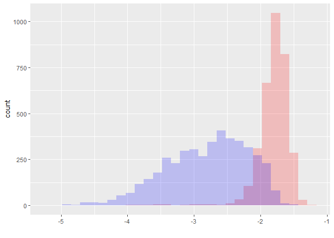

```{r setupand package loading, include=FALSE}
library(xtable)
library(data.table)
library(DT)
library(zoo)
library(dplyr)

knitr::opts_chunk$set(echo = FALSE)
```

## Inspiration: garbage in - garbage out: nothing is more true!

<center></center>

Picture from Applied Informatics (<http://blog.appliedinformaticsinc.com/data-mining-challenges-in-data-cleaning/>).

## "Sponsors" of today's theme

- [Davy Cielen, Arno D.B. Meysman, Mohamed Ali "Introducing Data Science: Big Data, Machine Learning, and more using Python tools"](https://www.manning.com/books/introducing-data-science)
- my colleagues Anton and two Kates and the tasks we solve daily
- Kaggle as antipode

## Practice follows: example datasets

```{r, echo = FALSE}
test_results_64_process <- read.csv2(file = "data/test_results_set_Feb_to_Apr.csv", stringsAsFactors = FALSE, nrows = 100)

test_results_64_process$header_col_3 <- as.POSIXct(as.character(test_results_64_process$header_col_3), format = "%Y-%m-%d %H:%M:%S", tz = "")
```

1. Dataset with "some" test results: contains `r nrow(test_results_64_process)` rows and `r ncol(test_results_64_process)` columns.

2. Datasets with test times for these test results:

```{r, echo = FALSE}
testtime_64_process <- read.csv2(file = "data/test_time_set_Feb_to_Apr_64_process.csv", stringsAsFactors = FALSE, nrows = 100)
testtime_66_process <- read.csv2(file = "data/test_time_set_Feb_to_Apr_66_process.csv", stringsAsFactors = FALSE, nrows = 100)

testtime_64_process$header2_col_3 <- as.POSIXct(as.character(testtime_64_process$header2_col_3), format = "%Y-%m-%d %H:%M:%S", tz = "")
testtime_66_process$header3_col_3 <- as.POSIXct(as.character(testtime_66_process$header3_col_3), format = "%Y-%m-%d %H:%M:%S", tz = "")
```

  + first process: contains `r nrow(testtime_64_process)` rows and `r ncol(testtime_64_process)` columns;
  + second process: contains `r nrow(testtime_66_process)` rows and `r ncol(testtime_66_process)` columns.

Quick summary on the data:

<center></center>

# Must-do | obligatory "sanity checks" when starting DA process

## Data Types

Always check data types before starting anything else. Most common points:

1. does string variable really mean string? Or factor?
2. are all the numerical data columns factors?
3. are all factors just factors or some of them are ranked?

> **Unofficial rule**: if unique values are 3% or less of all the data length - that might be a factor

Both Python, R (and Excel <i class="fa fa-frown-o"></i>) are trying to guess the column types - don't forget to cross-check it! Sometimes reading-all-in as characters and transforming onto numeric is better.

> **Certain methods "eat" certain types and it's better not to cheat on it!**

## Data types example:

```{r data types, echo = FALSE, results='asis'}
exploratory_info_before <- data.frame(colname = names(test_results_64_process))
exploratory_info_before$type <- sapply(test_results_64_process, typeof)
exploratory_info_before$num_of_unique_values <- apply(test_results_64_process, 2, function(x){length(unique(x))})
exploratory_info_before$num_of_unique_values_no_na <- apply(test_results_64_process, 2, function(x){ifelse(sum(is.na(x)) > 0, as.integer(length(unique(x)) -1), length(unique(x)))})
exploratory_info_before$NAs_percentage <- apply(test_results_64_process, 2, function(x){sum(is.na(x))/length(x)*100})

print.xtable(xtable(table(exploratory_info_before$type)), type = "html", include.rownames = TRUE)
```

LIVE DEMO: `header_col_3` (POSIX to integer), `test_result_col_1700` (integer), `test_result_col_282` (integer).

## Data distributions

Second-time view task mostly.

<div>
  
 
</div>

## NA values

- Is it a good idea to omit NAs?

*see what will happen if we'll omit NAs from our data sets directly*: rows in data with NA omit directly is **`r sum(complete.cases(test_results_64_process))`**!

So we'd better deal with NA more intelligently ;)

*Hint*: if there are lots of NAs in dataset, make a separate variable as NA percentage counter for every row - this may help later.

```{r, echo=FALSE, eval=FALSE}
test_results_64_process$na_percentage <- colMeans(is.na(test_results_64_process1))
```

***

Step-by-step NAs omitting:

* remove columns with high percentage of NAs (say, more than 95% of column are NAs);
* remove **rows** with high percentage of NAs (say, more than 90% of row are NAs);
* finally (though you can continue as long as needed!) filter out more columns (say, which have more than 75% of NAs).

```{r omit NA columns}
# Function to skip columns with high number of NAs, perc_in is a parameter, columns that have more than perc_in portion of NAs are excluded
filter_na_columns <-function(data_table_in, perc_in = 0.95){
  return(data_table_in[ , colMeans(is.na(data_table_in)) < perc_in])
}

test_results_64_process <- filter_na_columns(test_results_64_process, 0.95)
```

```{r omit NA rows}
# Function to skip rows with high number of NAs, perc_in is a parameter, rows that have more than perc_in portion of NAs are excluded
filter_na_rows <-function(data_table_in, perc_in = 0.7){
  return(data_table_in[rowMeans(is.na(data_table_in)) < perc_in, ])
}

test_results_64_process <- filter_na_rows(test_results_64_process, 0.9)
```

```{r omit NA columns 2}
# Filtering out more columns - which have more than 75 percent of missing values
test_results_64_process <- filter_na_columns(test_results_64_process, 0.75)
```

What we have how? **`r sum(complete.cases(test_results_64_process))`** rows that are complete!

## Multicollinearity

Inspiration: [Mercedes EDA & XGBoost Starter (~0.55) by anokas](https://www.kaggle.com/anokas/mercedes-eda-xgboost-starter-0-55)

1. **Constant features**: "Interestingly, we have ... features which only have a single value in them - these are pretty useless for supervised algorithms, and should probably be dropped (unless you want to use them for anomaly detection in case a different value appears in the test set)" => filtering out factors with 1 level only

```{r}
# Now filter out factors with 1 level only
test_results_64_process <- test_results_64_process[, apply(test_results_64_process, 2, function(x){ifelse(length(unique(x)) > 1, TRUE, FALSE)})]
```

2. "Near zero variance": a feature has near zero variance ifit has very few unique values relative to the number of samples and the ratio of the frequency of the most common value to the frequency of the second most common value is large.

```{r}
# Filter columns with near zero variance
exclude_near_zero_variance <- function(data_table_in, freqCut_in = 95/5, uniqueCut_in = 10){
  require('caret')
  nzvar<-nearZeroVar(data_table_in, freqCut = freqCut_in, uniqueCut = uniqueCut_in, names = TRUE, saveMetrics = FALSE)
  for(cols in nzvar)
    data_table_in[[cols]] <- NULL
  return (data_table_in[])
}

test_results_64_process <- exclude_near_zero_variance(test_results_64_process)
```

***

3. **Multicollinearity** by itself

```{r exclude multicollinear}
# Exclude completely collinear variables (corr > 0.99 between every two and > 0.96 among others) - dont' forger to save the header for later!
library(caret)

testtimedata_ready_filtered_for_cor <- select(testtimedata_ready_filtered, - (1:11), - CMDEXECUTIONTIMEINMIN)
correlationMatrix <- cor(testtimedata_ready_filtered_for_cor)
highlyCorrelated <- findCorrelation(correlationMatrix, cutoff=0.99, names = TRUE)

testtimedata_ready_filtered <- testtimedata_ready_filtered[, !(names(testtimedata_ready_filtered) %in% highlyCorrelated), with = FALSE]

rm(testtimedata_ready_filtered_for_cor, correlationMatrix, highlyCorrelated)
```

**NOTE**: when removing one of the collinear variables one should always remember that 99% becomes 96% when going through the columns etc.

## Outliers

TBD

## Other ideas for preliminary check

* misspellings;
* extra whitespaces;
* whitespace and tab problem;
* lowercase / uppercase.

# Tidying data

## Tidy data definition for today


## Headers and their analysis


взять table - для определения а) частот значений б) непересекающегося подмножества значений

## Data groups

- нужно ли делать данные на группы?
- если да, то по какой причине?
- в чем заключается различие между группами с точки зрения результатов именно этой задачи?- тесты на различие групповых средних и групповых дисперсий - лучший пример

## Data joining

Потом- - объединение данных друг с другом для решения конкретной задачи

## Insight first - analysis later

- если есть проблема - дожен быть пример проблемы с ожидаемым решением
- если нет примера - руки развязаны применять любые методы и получать любые результаты

## "Dealing with data" pipeline

Выстроить пайплайн, согласно которому всегда можно провести процесс получения данных еще раз. Использовать его для обновления датасета, и только его. Способ получения данных должен быть фиксированным

## Data book and column specifications

- не знаем спецификации колонок


Databook или описание данных или data dictionary - было бы классно, но встречается действительно редко

## Importance of Regular Expressions

Важность RegExp

# Task-dependant | funny stuff obtained for particular practice cases

## Time series quick classification

- проверка эмпирических распределений (чтобы они не менялись во времени)

# Moving on to practice

## Some exploratory info printout

```{r, echo = FALSE}
exploratory_info_after <- data.frame(colname = names(test_results_64_process))
exploratory_info_after$type <- sapply(test_results_64_process, typeof)
exploratory_info_after$num_of_unique_values <- apply(test_results_64_process, 2, function(x){length(unique(x))})
exploratory_info_after$num_of_unique_values_no_na <- apply(test_results_64_process, 2, function(x){ifelse(sum(is.na(x)) > 0, as.integer(length(unique(x)) -1), length(unique(x)))})
exploratory_info_after$NAs_percentage <- apply(test_results_64_process, 2, function(x){sum(is.na(x))/length(x)*100})
```

```{r exploratory info printout, results='asis', echo=FALSE, message=FALSE, warning=FALSE}
options(DT.options = list(pageLength = 8, autoWidth = TRUE, scrollX = TRUE))
datatable(exploratory_info_after)
```


- в задаче про test time цели могут ставить по-разному, от этого зависит и целевая переменнная. Если цель - 


